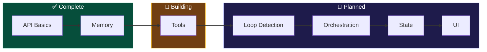

<div align="center">
  
  <p><strong>A structured learning journey to build AI agents from scratch, with hands-on lessons and working code examples.</strong></p>
</div>

# 🤖 AI Assistant That Grows - Learning Journey

**Learn to build AI agents from scratch through hands-on lessons with working code.** This structured curriculum takes you from basic API calls to sophisticated agents with memory, tools, and state management - no confusion, no getting stuck in loops, just clear progression with real examples you can run immediately.

## What This Is

A progressive learning path that demystifies AI agent development. Each lesson builds on the previous one with:
- **Working Python code** you can run right now
- **Clear explanations** of what's actually happening under the hood
- **Real insights** about costs, limitations, and practical considerations
- **No magic** - just understanding how the pieces fit together

Perfect for developers who want to understand AI agents beyond surface-level tutorials.

## 📚 Current Progress

### ✅ Lesson 1: API Basics (COMPLETE)
**What you'll learn:**
- AI APIs are just text in → text out (no magic!)
- API key setup and authentication
- Model selection and cost implications (gpt-4o-mini vs gpt-4o = 33x cost difference)
- Token counting and real-world pricing

**Key files:** `exercise1_basic_call.py`, `model_comparison.py`, `interactive_chat.py`

### ✅ Lesson 2: Memory Fundamentals (COMPLETE)  
**What you'll learn:**
- AI has ZERO memory - forgets everything instantly
- How to implement conversation memory (it's just sending history)
- Different memory strategies: full history, rolling window, summarization
- Memory costs and trade-offs

**Key files:** `no_memory.py`, `with_memory.py`, `rolling_window_memory.py`, `visual_memory.py`

### 📍 Next: Lesson 3 - Adding Tools
**Coming up:**
- Function calling - let AI DO things, not just talk
- Tool selection and execution
- Building a calculator tool
- Understanding the AI decision vs execution split

## 🚀 Quick Start

```bash
# Clone and enter directory
git clone https://github.com/yourusername/ai-assistant-grows
cd ai-assistant-grows

# Set up your API key
echo "OPENAI_API_KEY=your_key_here" > .env

# Try the basic examples
cd "Lesson 1"
python exercise1_basic_call.py

# See memory in action
cd "../Lesson 2"
python no_memory.py    # Watch it forget everything
python with_memory.py  # Now it remembers!
```

## 📋 Full Learning Path



- **Lesson 1:** API Basics ✅
- **Lesson 2:** Memory Systems ✅  
- **Lesson 3:** Tool Integration (In Progress)
- **Lesson 4:** Loop Detection & Prevention
- **Lesson 5:** Multiple Tool Orchestration
- **Lesson 6:** State Management & Persistence
- **Lesson 7:** UI Integration (Optional)

## 💡 Key Insights Discovered

- **APIs are simple:** Just JSON messages, no magic
- **Memory is manual:** AI forgets everything; you must remind it
- **Costs matter:** Token counting directly impacts your bill
- **Loops happen:** Agents get stuck without proper guardrails

## Requirements

- Python 3.7+
- OpenAI API key
- Basic command line knowledge

## What This Isn't

This isn't a production-ready agent framework. It's an educational journey that prioritizes understanding over polish. Each lesson focuses on one concept with minimal code so you can see exactly what's happening.

---

**Ready to understand how AI agents really work?** Start with Lesson 1 and work your way through. Each lesson takes 30-60 minutes and leaves you with working code and real understanding.